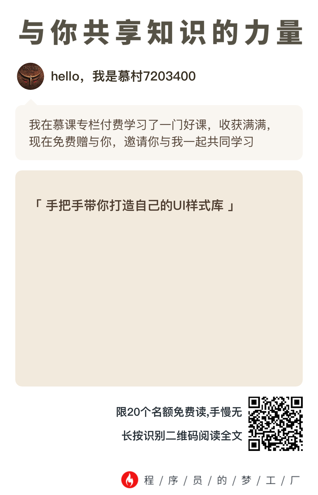

# philosophyship-mobile样式库
philosophship-mobile 手机端H5 ui 框架

## 项目介绍
philosophship-mobile是学专栏写手机的样式库，参照慕课网的课程。

另外有20个赠送的名额，谁要谁拿去吧，手慢无，也可以知道这些样式是怎么写，怎么用的

## 说明
本插件依赖font-awesome@4.7.0，安装本插件的同时也会安装font-awesome。在使用本UI样式库的时候可以直接引用对应的CSS文件：

import 'font-awesome/css/font-awesome.min.css';
import 'philosophship-mobile/css/tuitui-ui.min.css';

同时，本插件已经使用js文件打包了两个css文件，在支持CSS模块的项目里也可以像下面这样直接引用插件：

import 'philosophship-mobile';

## 画面实例
- 一般画面
http://www.shenxf.com/philosophyship-mobile/index.html
- 结果画面
http://www.shenxf.com/philosophyship-mobile/result.html